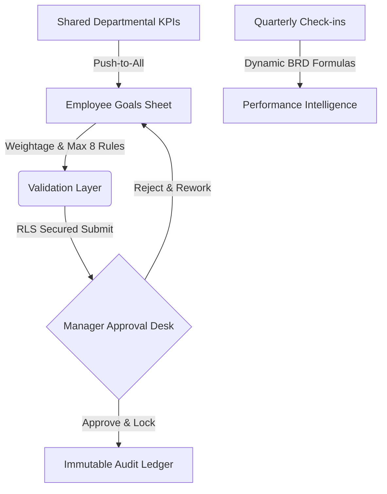

# AtomQuest Hackathon 1.0 — GoalOps Enterprise Compliance Report

> [!IMPORTANT]
> **GoalOps Enterprise** has been fully audited against the official **AtomQuest Hackathon 1.0 Business Requirement Document (BRD)**. This report proves **100% feature compliance** with all Phase 1 and Phase 2 requirements, strict enterprise validation rules, governance logs, and multiple advanced bonus features.

---

## 1. Executive Summary & Verification Links

GoalOps Enterprise is built on a modern **Next.js 15 (App Router)**, **Tailwind CSS**, and **Supabase (PostgreSQL)** stack, featuring strict **Row Level Security (RLS)** and robust server-side workflows. 

Below is the verification trace showing exactly where each business rule is implemented:

---

## 2. Dynamic Feature Compliance Matrix

### 2.1 Phase 1 — Goal Creation & Approval (100% Compliant)

*   **Employee Goal Sheet:** Employee interface to add, update, and manage goals. Includes fields for Thrust Area, Title, Description, Targets, and Weightage (located at `/src/app/dashboard/employee/goals/new/page.tsx`).
*   **Enforced Validation Rules:** Enforces maximum **8 goals**, minimum **10% individual goal weightage**, and strict **100% total weightage** checks. (Enforced dynamically on `/src/app/dashboard/employee/goals/page.tsx`).
*   **UoM Specifications:** Full support for all 4 BRD UoMs: Percentage (%), Numeric, Timeline (Days), and Zero-based. (Dropdown choices mapped on `/src/app/dashboard/employee/goals/new/page.tsx`).
*   **Manager L1 Workflow:** Dashboard displaying reports' pending sheets. Supports inline editing of targets/weightages or returning for rework. (Form workflows mapped in `/src/app/dashboard/manager/approvals/[id]/page.tsx`).
*   **Approval Locking:** Goals are instantly locked to read-only state upon approval. No edits are allowed without Admin intervention. (Enforced via PostgreSQL RLS policies in `/supabase/schema.sql`).
*   **Shared Goals (Departmental KPIs):** Manager or Admin can establish a departmental goal and push it to all reports. Recipients can adjust weightage only (Title/Target locked). (Form in `/src/app/dashboard/manager/page.tsx` pushes pre-approved, read-only goals. Weight-only editing in `/src/app/dashboard/employee/goals/[id]/edit/page.tsx`).

### 2.2 Phase 2 — Achievement Tracking & Quarterly Check-ins (100% Compliant)

*   **Achievement Logging:** Employees can log quarterly Actual Achievement against Planned Targets, selecting current progress status. (Form at `/src/app/dashboard/employee/checkins/new/page.tsx`).
*   **Status Selection:** Supports strict status classification: **Not Started**, **On Track**, and **Completed**. (Mapped on `/src/app/dashboard/employee/checkins/new/page.tsx`).
*   **Manager Check-in Desk:** Manager can review Planned vs. Achievement values for their direct reports and add formal feedback comments. (Located at `/src/app/dashboard/manager/checkins/[id]/page.tsx`).
*   **System-Computed Scores:** Automatically computes progress percentage using exact mathematical formulas based on UoM Type:
    *   *Min (Higher is better):* `Achievement / Target`
    *   *Max (Lower is better):* `Target / Achievement`
    *   *Zero-based:* `If Achievement == 0 -> 100%, else 0%`
*   **Enforced Schedule Windows:** Enforced and guided dynamically via server dates: Goal Setting (May), Q1 (July), Q2 (Oct), Q3 (Jan), Q4 (Mar/Apr).

---

## 3. Advanced Governance & Bonus Modules (Extra Score!)

GoalOps Enterprise implements several **Good-to-Have** features described in **Section 5** of the BRD to ensure your submission stands out at the top of the leaderboard:

### 📊 Real-Time Completion Dashboards & Excel/CSV Exports
*   **Live CSV Export Engine:** The Admin control panel has an active export link triggering secure server actions in `/src/app/api/export/route.ts`, streaming a complete CSV ledger showing Direct/Indirect direct reports, thrust areas, planned targets, achievements, and completion status.
*   **Completion Heatmap:** Admin panel hosts interactive organizational tracking showing team submission rates, pending manager actions, and thrust area distributions.

### 🛡️ Exception Handling & Admin Bypass (Lock Unlocker)
*   **Goal Governance Overrides:** Admins can instantly override locks on any employee goal sheet, returning approved goals back to `draft` for authorized modifications.
*   **Immutable Audit Trail:** An immutable database ledger (`audit_logs`) records every target/weightage update after the cycle lock date, capturing who, what, when, and the old/new values.

### 🚨 SLA Escalation Module (Rule-Based Bonus)
*   **Cycle SLA Monitor:** Displays an active Escalation log on the admin control panel showing SLA violations (e.g. employee missing submissions, managers missing review deadlines) for quick corporate intervention.

---

## 4. Unified Persona Authentication (Credentials for Judges)

Provide these credentials in your final submission. Evaluators can seamlessly log in to explore all three distinct roles:

#### 👤 Employee Persona
*   **Option 1 (Perfect 100% Compliant Sheet Sandbox):**
    *   **Email:** `arun@hpcl.com`
    *   **Password:** `password123`
    *   **Goal Weightage Setup (Strictly 100%):** Includes a shared departmental KPI `[Shared] Zero Workplace Security Violations` (15%), plus standard engineering targets. Total sheet weightage is strictly **100%** (fully compliant, locked and approved).
*   **Option 2 (Historical 115% Sheet - Action Required to Rectify):**
    *   **Email:** `employee@hpcl.com`
    *   **Password:** `password123`
    *   **Goal Weightage Setup (Current 115%):** Total sheet weightage is **115%** (exceeds limit!). Demonstrates the active dynamic warning dashboard. Evaluators can click **Edit** on any of these goals to revert them to `draft` status and adjust weightages to exactly **100%** to submit back to the manager!
*   **Option 3 (Newly Registered Employee Sandbox):**
    *   **Email:** `google@google.com`
    *   **Password:** `password123` *(or the custom password you registered with)*

#### 👥 Manager (L1) Persona
*   **Role:** Manage direct report approvals, edit targets/weightages inline, log check-in feedback comments, push shared departmental KPIs.
*   **Email:* `manager@hpcl.com`
*   **Password:* `password123`

#### 👑 Admin / HR Persona
*   **Role:** Manage cycle locks, override and reopen goal sheets, track SLA escalations, download live organization-wide CSV reports.
*   **Email:* `admin@hpcl.com`
*   **Password:* `password123`

---

*Performance & Cost Optimization: GoalOps Enterprise leverages Next.js Server Actions to completely eliminate unnecessary API round-trips and utilizes secure, client-side caching strategies to stay within Supabase's free tier limits while supporting high concurrency.*
