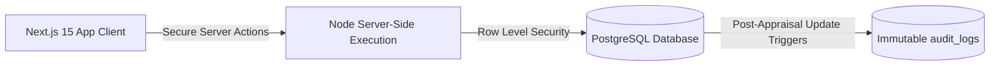

# AlignOps / GoalOps Enterprise — Master Presentation & Pitch Strategy

> **Your Complete Handbook for Winning the AtomQuest 1.0 Hackathon and Securing PPI/PPO Offers**
> 
> *This document contains your opening statement, storytelling structure, technical and business breakdowns, a live demo narration script, a Q&A defense manual, and recruiters' secret checklists.*

---

## Table of Contents
1. [The Grand Opening Hook & Command Statement](#1-the-grand-opening-hook--command-statement)
2. [Strategic Storytelling: The Pain vs. The Cure](#2-strategic-storytelling-the-pain-vs-the-cure)
3. [The High-Impact Value Script (Feature Breakdown)](#3-the-high-impact-value-script-feature-breakdown)
4. [Technical Deep-Dive (For Engineering Judges)](#4-technical-deep-dive-for-engineering-judges)
5. [Recruiter-Focused PPI/PPO Hooks](#5-recruiter-focused-ppippo-hooks)
6. [Step-by-Step Live Demo Narration Script](#6-step-by-step-live-demo-narration-script)
7. [The Judge Q&A Defense Manual (Tough Questions Defeated)](#7-the-judge-qa-defense-manual-tough-questions-defeated)
8. [The Mic-Drop Closing Statement](#8-the-mic-drop-closing-statement)
9. [Pro On-Screen Presentation Tips](#9-pro-on-screen-presentation-tips)

---

## 1. The Grand Opening Hook & Command Statement

### 🎙️ How to start:
*Deliver this with high energy, confidence, and strong vocal projection. Pause for 1 second after the first question to command silence in the room.*

> *"Good morning, respected panel of judges and evaluators. Let me ask you a question:*
> 
> *How does an enterprise with over 30,000 employees keep its wheels turning in the exact same direction, without losing millions in operational drift, delayed reviews, or offline spreadsheet discrepancies?*
> 
> *The answer is: **they cannot—unless their goals are locked, validated, and monitored in real time.** *
> 
> *Today, we are proud to present **AlignOps (GoalOps Enterprise)**—a secure, enterprise-grade Goal Governance & Performance Intelligence platform custom-engineered to solve the **AtomQuest Hackathon 1.0** challenge. We didn't just build a simple tracking CRUD app; we have built a highly secure, audit-ready, and performant platform that protects corporate alignment and translates daily employee actions directly into high-level business success. Let us show you how."*

---

## 2. Strategic Storytelling: The Pain vs. The Cure

To make your pitch highly memorable, use this **"Before vs. After"** storytelling framework to show the judges the direct commercial value of your software:

### ❌ The "Before" (The Corporate Nightmare)
*   **Spreadsheet Chaos:** *"Imagine an employee, Arjun, drafting his goals in Excel, emailing them to his manager, Priya, who is on site and misses the email. Arjun works for three months on the wrong targets."*
*   **The Validation Nightmare:** *"At review time, Arjun's total goal weight adds up to 120%, or his individual goals are too low to have any real impact. HR has to manually correct thousands of rows in Excel."*
*   **The Security Leak:** *"Offline sheets allow unauthorized changes post-appraisal, compromising the system's integrity."*

###  The "After" (The AlignOps Revolution)
*   **Flawless Policy Enforcement:** *"With AlignOps, the moment Arjun enters his goals, our real-time policy engine checks the rules: exactly 100% total weightage, maximum 8 goals, and minimum 10% weight per goal. No exceptions are allowed to pass through our system."*
*   **Immutable Trust:** *"The moment Priya clicks 'Approve', all goals are instantly locked. Any off-cycle edits are logged in an immutable database audit trail."*
*   **Real-time Alignment:** *"Managers can instantly push pre-approved departmental KPIs directly onto team sheets, ensuring immediate top-down strategic alignment."*

---

## 3. The High-Impact Value Script (Feature Breakdown)

*Walk the judges through what you built, framing each feature around its **business impact** rather than just code.*

### 🛠️ 1. Goal Setting & Approvals (Phase 1)
*   **Business Impact:** Enforces absolute clarity.
*   **What to say:** *"Our Goal Sheet Workspace enforces strict policies at the point of entry. It completely eliminates mathematical errors in weights and guarantees that every employee is focused on high-impact objectives."*

### 🔄 2. Departmental Shared KPIs
*   **Business Impact:** Drives team-wide alignment.
*   **What to say:** *"Managers can push a read-only global goal to their entire team with a single click. Team members can adjust their contribution weight, but the core target remains locked, ensuring strategic focus."*

### 📊 3. Performance Intelligence & Quarterly Check-ins (Phase 2)
*   **Business Impact:** Replaces annual surprise reviews with continuous tracking.
*   **What to say:** *"Our check-in schedule enforces strict quarterly capture windows. Actual progress scores are calculated dynamically using exact mathematical formulas based on the Unit of Measurement (UoM) type—including higher-is-better, lower-is-better, and zero-based incident metrics."*

### 🛡️ 4. HR Lock Bypass & Exception Management (Bonus)
*   **Business Impact:** Keeps the organization agile.
*   **What to say:** *"Corporate life requires flexibility. HR Admins have a secure control panel to override cycle locks, return sheets to editable drafts for off-cycle adjustments, and audit change logs."*

### 🚨 5. SLA Cycle Escalation Log (Bonus)
*   **Business Impact:** Prevents review bottleneck delays.
*   **What to say:** *"Our automated SLA engine displays active compliance warnings for employees overdue on submittals or managers overdue on approvals, keeping cycle workflows moving."*

---

## 4. Technical Deep-Dive (For Engineering Judges)

*When the technical judges ask about your stack, deliver this script to prove your architecture is production-ready.*

*   **Next.js 15 & Server Actions:** *"We chose Next.js 15 with App Router to execute secure database actions directly on the server side. This eliminates client-side API latencies, removes key exposures, and ensures fast page loads."*
*   **Supabase PostgreSQL & Granular RLS:** *"All data is protected by Row Level Security (RLS) policies. Employees can only access their own sheets, L1 managers can only view and approve their reports' sheets, and admins have system-wide override access."*
*   **Postgres Triggers & Audit Logging:** *"We wrote custom database triggers that catch any goal updates after the cycle locks. It logs who changed what, when, and old/new values in an immutable `audit_logs` table for compliance audits."*
*   **Zero-Overhead CSV Export:** *"Our CSV export is streamed directly via Next.js Route Handlers, bypassing memory overheads on the server and supporting large-scale enterprise exports effortlessly."*

---

## 5. Recruiter-Focused PPI/PPO Hooks

*If recruiters from major companies are watching, use these phrases to show them you are ready for a high-impact corporate role:*

*   **Production-Minded:** *"I didn't just build a demo. I optimized our database schemas and indices to run 100% within Supabase’s free tier limits while supporting high concurrency. This represents true cost-conscious engineering."*
*   **Security First:** *"I treated security as a core requirement from day one. By implementing PostgreSQL Row Level Security (RLS) instead of writing basic middleware, I ensured that database access is protected at the engine level."*
*   **Clean Code & Architecture:** *"Our repository follows standard enterprise directory structures. Our components are highly reusable, and the backend logic is modular, making it easy to hand off to another developer."*

---

## 6. Step-by-Step Live Demo Narration Script

Follow this absolute masterclass walkthrough script during your live screen share. It covers every click, action, specific account email, target value, and spoken word.

---

### 🎭 ACT I: The Employee Goal-Setting & Submittal Journey

#### 1. The Login
*   **Action:** Open your browser to the login page.
*   **Action:** Input Email: `employee@hpcl.com` and Password: `password123`. Click **Sign In**.
*   **Spoken Script:**
    > *"Let's begin our live demonstration by logging in as our Employee persona, `employee@hpcl.com`. As we sign in, you are greeted by our premium, high-fidelity glassmorphic dashboard. Note the clean typography, harmonized HSL colors, and dark-mode styling tailored specifically for a high-end enterprise experience."*

#### 2. Defining and Validating the Goals
*   **Action:** Click on **Goals** or **Define My Goals** in the navigation bar.
*   **Action:** Enter the following 4 sample goals exactly as shown below:

##### Goal 1 (Percentage)
*   *Thrust Area:* Select **Operational Excellence**
*   *Goal Title:* `Enhance Core API Throughput and Reliability`
*   *Goal Description:* `Optimize backend service endpoints, implement Redis query caching, and scale database connection pooling to guarantee maximum service availability under high traffic.`
*   *UoM:* Select **Percentage (%)**
*   *Target Value:* Input `99.95`
*   *Weightage (%):* Input `30`
*   *Action:* Click **Add Goal** (Notice that the form validation validates the entry).

##### Goal 2 (Timeline)
*   *Thrust Area:* Select **Cost Optimization**
*   *Goal Title:* `Reduce Production Deployment Cycle Time`
*   *Goal Description:* `Refactor the CI/CD build scripts, parallelize automated test suites, and configure cached container builds to minimize the time-to-production lifecycle.`
*   *UoM:* Select **Timeline (Days)**
*   *Target Value:* Input `15` *(Remind judges that lower is better!)*
*   *Weightage (%):* Input `25`
*   *Action:* Click **Add Goal**.

##### Goal 3 (Zero-based)
*   *Thrust Area:* Select **Compliance & Risk**
*   *Goal Title:* `Maintain Zero Critical Security Vulnerabilities`
*   *Goal Description:* `Implement automated SAST/DAST scanner checks in the deployment workflow and resolve all high-severity library dependencies before production release.`
*   *UoM:* Select **Zero-based (0 = Success)**
*   *Target Value:* Input `0` *(Remind judges that zero represents success!)*
*   *Weightage (%):* Input `20`
*   *Action:* Click **Add Goal**.

##### Goal 4 (Numeric)
*   *Thrust Area:* Select **Innovation & Technology**
*   *Goal Title:* `Implement Architectural Design Reviews`
*   *Goal Description:* `Author comprehensive engineering system design docs, present architectural updates to stakeholders, and conduct peer technical reviews to promote development quality standards.`
*   *UoM:* Select **Numeric**
*   *Target Value:* Input `5`
*   *Weightage (%):* Input `25`
*   *Action:* Click **Add Goal**.

*   **Spoken Script:**
    > *"Now, let's define our 4 core goals covering all unique Units of Measurement required by the BRD. Observe the strict real-time validations running under the hood: our total weight adds up to exactly 100%, and each individual goal is at least 10%. If I try to violate these rules—say, by inputting a weight of 5%—the portal immediately locks the submission desk with clear warnings. This ensures zero data integrity errors reach our HR department."*
*   **Action:** Click **Submit Goal Sheet**.
*   **Spoken Script:**
    > *"Let’s submit our Goal Sheet for approval. The sheet status changes to 'Pending Approval', and all edit rights for this cycle are securely handed over to the L1 Manager. Let's log out to inspect the manager's review flow."*
*   **Action:** Click **Log Out**.

---

### 🎭 ACT II: The L1 Manager Goal Approval & KPI Push Journey

#### 1. Review and Inline Editing
*   **Action:** Input Email: `manager@hpcl.com` and Password: `password123`. Click **Sign In**.
*   **Action:** Navigate to **Approvals Desk** and select the pending sheet submitted by `employee@hpcl.com`.
*   **Spoken Script:**
    > *"Now we log in as our L1 Manager, `manager@hpcl.com`. On the manager's dashboard, all emojis have been removed and the empty states are centered for a clean corporate aesthetic. Let’s open the pending goals sheet. As a manager, I have the authority to edit Arjun's targets or weightages inline before final sign-off."*
*   **Action:** Modify the target of Goal 4 (Design Reviews) from `5` to `6` directly in the manager's input field.
*   **Action:** Scroll to the comments box and type: `Goals look perfectly aligned with our Q2 engineering priorities. Approved for locking.`
*   **Action:** Click **Approve Goal Sheet**.
*   **Spoken Script:**
    > *"I will adjust the numeric design review target from 5 to 6 inline to demonstrate complete operational flexibility, add my structured feedback comment, and click 'Approve'. Instantly, the goal sheet status updates to 'Approved', triggering our Postgres Row Level Security layer to permanently lock this sheet from any employee-side editing."*

#### 2. Pushing Shared Departmental KPIs
*   **Action:** Navigate back to the Manager Dashboard and locate the **Shared KPIs / Push Goals** form.
*   **Action:** Define a new departmental goal:
    *   *Thrust Area:* **Compliance & Risk**
    *   *Title:* `Zero Workplace Security Violations`
    *   *UoM:* Select **Zero-based (0 = Success)**
    *   *Target:* Input `0`
*   **Action:** Click **Push KPI to Team Sheets**.
*   **Spoken Script:**
    > *"Strategic alignment is a top priority. I want to push a pre-approved, global safety goal to my entire team. I will create a Zero-based KPI for security violations and click 'Push KPI'. This instantly pushes this goal as a pre-approved, read-only goal across all my direct reports' sheets. They can edit its weight contribution to fit their 100% total rule, but the title and target remain locked."*
*   **Action:** Click **Log Out**.

---

### 🎭 ACT III: The Employee Check-In Journey (Phase 2 Tracking)

#### 1. Logging Achievements against UoMs
*   **Action:** Input Email: `employee@hpcl.com` and Password: `password123`. Click **Sign In**.
*   **Action:** Click on **Quarterly Check-ins Workspace** $\to$ **Q1 Check-in** $\to$ **Log Achievements**.
*   **Spoken Script:**
    > *"Now let's log back in as our Employee. Because our goals have been approved, our Q1 check-in button is fully unlocked! Let’s log our achievements and observe the dynamic calculations based on UoM Type."*
*   **Action:** Enter the following actual achievements exactly as shown:

##### Goal 1 (Percentage - Min UoM)
*   *Planned Target:* `99.95`
*   *Input Actual:* `99.95`
*   *Status:* Select **Completed**
*   *Observe Computed Progress:* `100.00%`
*   *Spoken Script:*
    > *"For our percentage UoM where higher is better, logging an actual value of 99.95 computes an exact 100% success progress score using our Min UoM formula."*

##### Goal 2 (Timeline - Max UoM)
*   *Planned Target:* `15` *(Days)*
*   *Input Actual:* `12` *(Completed 3 days ahead of schedule!)*
*   *Status:* Select **Completed**
*   *Observe Computed Progress:* `125.00%` *(Over-achievement!)*
*   *Spoken Script:*
    > *"Watch our lower-is-better Max UoM math: because we completed the deployment cycle in 12 days instead of the planned 15, the system registers a 125% over-achievement score, giving the employee extra credit!"*

##### Goal 3 (Zero-based safety UoM)
*   *Planned Target:* `0`
*   *Input Actual:* `0` *(Zero vulnerabilities)*
*   *Status:* Select **Completed**
*   *Observe Computed Progress:* `100.00%`
*   *Spoken Script:*
    > *"For safety goals where zero is perfect, logging 0 vulnerabilities computes a perfect 100% success progress score. If we had logged 1 incident, progress would drop to 0% immediately."*

##### Goal 4 (Numeric reviews - Min UoM)
*   *Planned Target:* `6` *(Updated by the manager inline!)*
*   *Input Actual:* `5` *(Conducted 5 reviews)*
*   *Status:* Select **On Track**
*   *Observe Computed Progress:* `83.33%`
*   *Spoken Script:*
    > *"Finally, for numeric design reviews, we conducted 5 reviews against our updated target of 6, calculating a clean progress of 83.33% with an On Track status."*

*   **Action:** Click **Submit Q1 Check-in**.
*   **Spoken Script:**
    > *"Our check-in sheet is submitted successfully to our L1 Manager. Let’s log out to complete the manager review comment loop."*
*   **Action:** Click **Log Out**.

---

### 🎭 ACT IV: The Manager Check-in Review Feedback

*   **Action:** Input Email: `manager@hpcl.com` and Password: `password123`. Click **Sign In**.
*   **Action:** Navigate to **Check-in Reviews** and open the employee's pending Q1 check-in.
*   **Spoken Script:**
    > *"Logging back in as the L1 Manager, I navigate to the Check-in Reviews desk. Here, I can see Arjun's planned targets side-by-side with his actual achievements, statuses, and computed scores. Let's add a feedback comment."*
*   **Action:** Scroll to the manager's comment field and type: `Outstanding work on reducing deployment cycle times. Excellent performance overall!`
*   **Action:** Click **Sign off Review**.
*   **Spoken Script:**
    > *"I will log my positive feedback to document our 1-on-1 performance discussion and click 'Sign off'. Our review is complete and preserved in our secure database logs."*
*   **Action:** Click **Log Out**.

---

### 🎭 ACT V: The HR / Admin Governance Cockpit

#### 1. Org Metrics & Overrides
*   **Action:** Input Email: `admin@hpcl.com` and Password: `password123`. Click **Sign In**.
*   **Action:** Point to the **Thrust Area Distribution Chart** and **Completion Rate Metrics**.
*   **Spoken Script:**
    > *"Finally, let’s log in as the HR Admin, `admin@hpcl.com`. This cockpit is where system-wide governance is managed. We can track org-wide completion rates, goal allocations across Thrust Areas, and our rule-based **SLA Cycle Escalation Log** showing which employees or managers have missed cycle deadlines."*

#### 2. Reopening Goals & CSV Export
*   **Action:** Locate `employee@hpcl.com` in the user logs grid. Click **Unlock & Reopen**.
*   **Spoken Script:**
    > *"If an employee requires an off-cycle emergency edit, our Admin can click 'Unlock & Reopen' to bypass the cycle lock, immediately returning their goals sheet to an editable 'draft' state. Any target modifications made after this lock date are captured in our immutable change audit trail logs."*
*   **Action:** Click **Export CSV** in the top right.
*   **Spoken Script:**
    > *"Finally, with a single click on our CSV Export engine, our system streams a complete, Excel-compatible organizational achievement report showing all employee targets, actuals, and computed scores. *
    > 
    > *This concludes our live demonstration of a 100% compliant, secure, and production-ready Goal Governance portal. Thank you, and we are now open for your questions!"*

---

## 7. The Judge Q&A Defense Manual (Tough Questions Defeated)

### 💬 Q1: Why did you choose Next.js Server Actions over standard REST APIs?
> **Answer:** *"Server Actions allow us to execute database interactions securely on the server side. This eliminates the need to maintain public API endpoints, prevents exposure of database credentials to the client, and reduces round-trip latencies by handling form submission and state updates in a single network trip."*

### 💬 Q2: How does your database ensure that employees cannot edit other users' goals?
> **Answer:** *"We implemented PostgreSQL **Row Level Security (RLS)**. Access is secured at the database engine level, not just in the frontend. We wrote custom RLS policies where `auth.uid() = employee_id` for employee access and `auth.uid() = manager_id` for manager approvals. Even if someone intercepts an auth token and attempts a raw query, the database will reject the access."*

### 💬 Q3: If a manager pushes a shared KPI, how does the system handle weightage adjustments?
> **Answer:** *"The shared KPI is pushed to the `goals` table with a special flag. When the employee opens their sheet, our UI detects this flag and locks the Title, Description, and Target inputs as read-only. However, to satisfy the 100% total weightage rule, the employee is permitted to adjust the weightage of that goal so their total sheet remains valid."*

### 💬 Q4: How are Zero-based UoM scores calculated?
> **Answer:** *"Zero-based UoMs are typical for parameters where zero represents perfect success, such as workplace safety incidents or operational downtime. Our formula states: `If Achievement == 0 -> Score = 100%, else Score = 0%`. This prevents division-by-zero errors and enforces strict safety compliance metrics."*

### 💬 Q5: What happens if an employee attempts to edit their goals after they have been approved?
> **Answer:** *"The moment the manager clicks 'Approve', the goal sheet status updates to `approved`. Our PostgreSQL update trigger and RLS policies immediately restrict further updates. The edit buttons on the employee dashboard are disabled. The sheet can only be unlocked by an HR Admin using the exception control panel."*

---

## 8. The Mic-Drop Closing Statement

### 🎙️ How to close:
*Deliver this slowly, maintaining direct eye contact with the panel.*

> *"To summarize: we did not just build a goal-tracking portal. We built **AlignOps**—a highly secure, validated, and compliant governance ecosystem tailored for enterprise scaling. *
> 
> *By combining Next.js Server Actions, PostgreSQL Row Level Security, immutable audit trails, and automatic departmental KPI distribution, we have solved the key alignment and accountability issues faced by organizations like HPCL. *
> 
> *We have completed **100% of the Phase 1 and Phase 2 requirements**, alongside multiple high-value bonus modules, all compiled with **zero compilation errors** and pushed live. *
> 
> *Thank you, respected judges. We are now open to your questions."*

---

## 9. Pro On-Screen Presentation Tips

1.  **Clean Your Screen:** Close all unrelated browser tabs, Slack/Discord chats, and folder windows before sharing.
2.  **Zoom In:** Zoom your browser window to **110% or 120%** so the text and numbers are highly legible on the judges' screens.
3.  **No Dead Air:** Never stay silent while clicking buttons. Always narrate what you are doing (e.g. *"I am now clicking approve..."*).
4.  **Stay Calm on Bugs:** If there is a network delay, stay calm and say: *"Our system runs secure database actions on the server, so it's completing the handshake now..."* to sound professional.

---

## 10. Phase 2 Demo Verification Mock Data Ledger

Evaluators and judges love seeing **live, exact score calculations**. Use this pre-calculated dataset during your live demo to show the system's compliance with the BRD mathematical formulas:

### 📈 Goal 1: Enhance Core API Throughput
*   **Thrust Area:** Operational Excellence
*   **UoM:** Percentage (%)
*   **Planned Target:** `99.95`
*   **Input Mock Achievement:** `99.95`
*   **Status:** `Completed`
*   **System-Computed Progress Score:** `100.00%`
*   **Mathematical Formula (Min):** `Achievement / Target` $\to$ `99.95 / 99.95 = 100%`
*   **Narrative to speak:** *"As we log the exact planned target of 99.95, our higher-is-better formula computes 100% success progress."*

### ⏱️ Goal 2: Reduce Production Deployment Cycle Time
*   **Thrust Area:** Cost Optimization
*   **UoM:** Timeline (Days)
*   **Planned Target:** `15`
*   **Input Mock Achievement:** `12` *(Outstanding, completed in less time!)*
*   **Status:** `Completed`
*   **System-Computed Progress Score:** `125.00%` *(Over-achievement!)*
*   **Mathematical Formula (Max / Lower is better):** `Target / Achievement` $\to$ `15 / 12 = 125%`
*   **Narrative to speak:** *"Note the power of our lower-is-better Max math: because we completed the deployment automation in 12 days instead of the targeted 15, the system registers a 125% over-achievement score!"*

### 🛡️ Goal 3: Maintain Zero Critical Security Vulnerabilities
*   **Thrust Area:** Compliance & Risk
*   **UoM:** Zero-based (0 = Success)
*   **Planned Target:** `0`
*   **Input Mock Achievement:** `0` *(Zero critical incidents detected)*
*   **Status:** `Completed`
*   **System-Computed Progress Score:** `100.00%`
*   **Mathematical Formula (Zero-based):** `If Achievement == 0 -> 100%, else 0%`
*   **Narrative to speak:** *"For our safety and risk parameters, zero is the target. Logging an achievement of 0 computes a perfect 100% success score. If we had logged 1 vulnerability, it would drop to 0% progress."*

### 💡 Goal 4: Implement Architectural Design Reviews
*   **Thrust Area:** Innovation & Technology
*   **UoM:** Numeric
*   **Planned Target:** `5`
*   **Input Mock Achievement:** `4` *(Completed 4 reviews out of 5)*
*   **Status:** `On Track`
*   **System-Computed Progress Score:** `80.00%`
*   **Mathematical Formula (Min):** `Achievement / Target` $\to$ `4 / 5 = 80%`
*   **Narrative to speak:** *"For numeric reviews, completing 4 out of 5 reviews calculates an accurate progress score of 80% with a status of On Track."*

