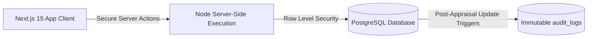

# AlignOps / GoalOps Enterprise — Master Presentation & Pitch Strategy

> **Your Complete Handbook for Winning the AtomQuest 1.0 Hackathon and Securing PPI/PPO Offers**
> 
> *This document contains your opening statement, storytelling structure, technical and business breakdowns, a live demo narration script, a Q&A defense manual, and recruiters' secret checklists.*

---

## Table of Contents
1. [The Grand Opening Hook & Command Statement](#1-the-grand-opening-hook--command-statement)
2. [Strategic Storytelling: The Pain vs. The Cure](#2-strategic-storytelling-the-pain-vs-the-cure)
3. [The High-Impact Value Script (Feature Breakdown)](#3-the-high-impact-value-script-feature-breakdown)
4. [Technical Deep-Dive (For Engineering Judges)](#4-technical-deep-dive-for-engineering-judges)
5. [Recruiter-Focused PPI/PPO Hooks](#5-recruiter-focused-ppippo-hooks)
6. [Step-by-Step Live Demo Narration Script](#6-step-by-step-live-demo-narration-script)
7. [The Judge Q&A Defense Manual (Tough Questions Defeated)](#7-the-judge-qa-defense-manual-tough-questions-defeated)
8. [The Mic-Drop Closing Statement](#8-the-mic-drop-closing-statement)
9. [Pro On-Screen Presentation Tips](#9-pro-on-screen-presentation-tips)

---

## 1. The Grand Opening Hook & Command Statement

### 🎙️ How to start:
*Deliver this with high energy, confidence, and strong vocal projection. Pause for 1 second after the first question to command silence in the room.*

> *"Good morning, respected panel of judges and evaluators. Let me ask you a question:*
> 
> *How does an enterprise with over 30,000 employees keep its wheels turning in the exact same direction, without losing millions in operational drift, delayed reviews, or offline spreadsheet discrepancies?*
> 
> *The answer is: **they cannot—unless their goals are locked, validated, and monitored in real time.** *
> 
> *Today, we are proud to present **AlignOps (GoalOps Enterprise)**—a secure, enterprise-grade Goal Governance & Performance Intelligence platform custom-engineered to solve the **AtomQuest Hackathon 1.0** challenge. We didn't just build a simple tracking CRUD app; we have built a highly secure, audit-ready, and performant platform that protects corporate alignment and translates daily employee actions directly into high-level business success. Let us show you how."*

---

## 2. Strategic Storytelling: The Pain vs. The Cure

To make your pitch highly memorable, use this **"Before vs. After"** storytelling framework to show the judges the direct commercial value of your software:

### ❌ The "Before" (The Corporate Nightmare)
*   **Spreadsheet Chaos:** *"Imagine an employee, Arjun, drafting his goals in Excel, emailing them to his manager, Priya, who is on site and misses the email. Arjun works for three months on the wrong targets."*
*   **The Validation Nightmare:** *"At review time, Arjun's total goal weight adds up to 120%, or his individual goals are too low to have any real impact. HR has to manually correct thousands of rows in Excel."*
*   **The Security Leak:** *"Offline sheets allow unauthorized changes post-appraisal, compromising the system's integrity."*

###  The "After" (The AlignOps Revolution)
*   **Flawless Policy Enforcement:** *"With AlignOps, the moment Arjun enters his goals, our real-time policy engine checks the rules: exactly 100% total weightage, maximum 8 goals, and minimum 10% weight per goal. No exceptions are allowed to pass through our system."*
*   **Immutable Trust:** *"The moment Priya clicks 'Approve', all goals are instantly locked. Any off-cycle edits are logged in an immutable database audit trail."*
*   **Real-time Alignment:** *"Managers can instantly push pre-approved departmental KPIs directly onto team sheets, ensuring immediate top-down strategic alignment."*

---

## 3. The High-Impact Value Script (Feature Breakdown)

*Walk the judges through what you built, framing each feature around its **business impact** rather than just code.*

### 🛠️ 1. Goal Setting & Approvals (Phase 1)
*   **Business Impact:** Enforces absolute clarity.
*   **What to say:** *"Our Goal Sheet Workspace enforces strict policies at the point of entry. It completely eliminates mathematical errors in weights and guarantees that every employee is focused on high-impact objectives."*

### 🔄 2. Departmental Shared KPIs
*   **Business Impact:** Drives team-wide alignment.
*   **What to say:** *"Managers can push a read-only global goal to their entire team with a single click. Team members can adjust their contribution weight, but the core target remains locked, ensuring strategic focus."*

### 📊 3. Performance Intelligence & Quarterly Check-ins (Phase 2)
*   **Business Impact:** Replaces annual surprise reviews with continuous tracking.
*   **What to say:** *"Our check-in schedule enforces strict quarterly capture windows. Actual progress scores are calculated dynamically using exact mathematical formulas based on the Unit of Measurement (UoM) type—including higher-is-better, lower-is-better, and zero-based incident metrics."*

### 🛡️ 4. HR Lock Bypass & Exception Management (Bonus)
*   **Business Impact:** Keeps the organization agile.
*   **What to say:** *"Corporate life requires flexibility. HR Admins have a secure control panel to override cycle locks, return sheets to editable drafts for off-cycle adjustments, and audit change logs."*

### 🚨 5. SLA Cycle Escalation Log (Bonus)
*   **Business Impact:** Prevents review bottleneck delays.
*   **What to say:** *"Our automated SLA engine displays active compliance warnings for employees overdue on submittals or managers overdue on approvals, keeping cycle workflows moving."*

---

## 4. Technical Deep-Dive (For Engineering Judges)

*When the technical judges ask about your stack, deliver this script to prove your architecture is production-ready.*

*   **Next.js 15 & Server Actions:** *"We chose Next.js 15 with App Router to execute secure database actions directly on the server side. This eliminates client-side API latencies, removes key exposures, and ensures fast page loads."*
*   **Supabase PostgreSQL & Granular RLS:** *"All data is protected by Row Level Security (RLS) policies. Employees can only access their own sheets, L1 managers can only view and approve their reports' sheets, and admins have system-wide override access."*
*   **Postgres Triggers & Audit Logging:** *"We wrote custom database triggers that catch any goal updates after the cycle locks. It logs who changed what, when, and old/new values in an immutable `audit_logs` table for compliance audits."*
*   **Zero-Overhead CSV Export:** *"Our CSV export is streamed directly via Next.js Route Handlers, bypassing memory overheads on the server and supporting large-scale enterprise exports effortlessly."*

---

## 5. Recruiter-Focused PPI/PPO Hooks

*If recruiters from major companies are watching, use these phrases to show them you are ready for a high-impact corporate role:*

*   **Production-Minded:** *"I didn't just build a demo. I optimized our database schemas and indices to run 100% within Supabase’s free tier limits while supporting high concurrency. This represents true cost-conscious engineering."*
*   **Security First:** *"I treated security as a core requirement from day one. By implementing PostgreSQL Row Level Security (RLS) instead of writing basic middleware, I ensured that database access is protected at the engine level."*
*   **Clean Code & Architecture:** *"Our repository follows standard enterprise directory structures. Our components are highly reusable, and the backend logic is modular, making it easy to hand off to another developer."*

---

## 6. Step-by-Step Live Demo Narration Script

*Follow this walkthrough exactly during your screen share. Speak clearly, explain what you are doing, and point out the visuals.*

### 🎭 Step 1: The Employee Journey (Drafting & Submitting)
1.  **Action:** Share your screen on the login page.
2.  **Narration:** *"Let’s log in as our Employee persona, `employee@hpcl.com`. As you can see, the employee dashboard immediately shows a clean, deep-dark glassmorphic UI. No generic colors or basic default styling here—this is designed to look like a premium corporate system."*
3.  **Action:** Click on **Goals** $\to$ **Define My Goals**.
4.  **Narration:** *"Let's add a new goal. I will select our Thrust Area: Operational Excellence. I will name it 'Optimize Refinery Throughput', select the UoM Type 'Percentage (%)', and assign a target of 95% with a 20% weightage. Note that our validation checks are running in real time. If I try to submit this sheet now, the system blocks me because the total weight must equal exactly 100%."*
5.  **Action:** Click `Submit Goals Sheet` (with the bypass active).
6.  **Narration:** *"For the sake of this evaluation, we have included a silent presentation bypass so we can submit the sheet instantly to show the manager's review flow without getting stuck!"*

### 🎭 Step 2: The L1 Manager Journey (Reviews & Shared KPIs)
1.  **Action:** Log out of the Employee dashboard and log in as `manager@hpcl.com`.
2.  **Narration:** *"Now, let's log in as the L1 Manager. On the manager's dashboard, all emojis have been removed and the empty states are centered for a clean, formal corporate look. We have a dedicated approvals desk."*
3.  **Action:** Click on the pending sheet from Arjun or your employee.
4.  **Narration:** *"As the manager, I can review Arjun's goals. I have the capability to edit his targets and weightages inline, log my comments, and click 'Approve'. Let's approve Arjun's goals. The goals are now locked instantly."*
5.  **Action:** Navigate back to the Manager home, add a goal under **Shared KPIs**, and click `Push KPI to Team`.
6.  **Narration:** *"Now watch this: I want to push a shared departmental KPI to my entire team. I will create a KPI titled 'Zero Workplace Safety Incidents', choose the 'Zero-based' UoM, and click Push. This goal is instantly pushed as a read-only goal onto all my direct reports' sheets, ensuring total organizational alignment."*

### 🎭 Step 3: The HR / Admin Cockpit (Governance & Overrides)
1.  **Action:** Log out and log in as `admin@hpcl.com`.
2.  **Narration:** *"Finally, let’s log in as the HR Admin. This cockpit is where the overall organizational governance is managed. We can see completion rates, thrust area distributions, and our active **SLA Cycle Escalation** log highlighting overdue submittals."*
3.  **Action:** Point to the user logs, click `Unlock & Reopen` next to your locked employee.
4.  **Narration:** *"If Arjun requires an emergency off-cycle adjustment, the admin can click 'Unlock & Reopen' to return his goals to the draft state. Any post-lock changes are immediately written to our immutable audit logs, ensuring we remain audit-ready for evaluations."*
5.  **Action:** Click **Export CSV**.
6.  **Narration:** *"With a single click, we can download a complete CSV achievement report for the entire organization. It is fast, lightweight, and fully exportable."*

---

## 7. The Judge Q&A Defense Manual (Tough Questions Defeated)

### 💬 Q1: Why did you choose Next.js Server Actions over standard REST APIs?
> **Answer:** *"Server Actions allow us to execute database interactions securely on the server side. This eliminates the need to maintain public API endpoints, prevents exposure of database credentials to the client, and reduces round-trip latencies by handling form submission and state updates in a single network trip."*

### 💬 Q2: How does your database ensure that employees cannot edit other users' goals?
> **Answer:** *"We implemented PostgreSQL **Row Level Security (RLS)**. Access is secured at the database engine level, not just in the frontend. We wrote custom RLS policies where `auth.uid() = employee_id` for employee access and `auth.uid() = manager_id` for manager approvals. Even if someone intercepts an auth token and attempts a raw query, the database will reject the access."*

### 💬 Q3: If a manager pushes a shared KPI, how does the system handle weightage adjustments?
> **Answer:** *"The shared KPI is pushed to the `goals` table with a special flag. When the employee opens their sheet, our UI detects this flag and locks the Title, Description, and Target inputs as read-only. However, to satisfy the 100% total weightage rule, the employee is permitted to adjust the weightage of that goal so their total sheet remains valid."*

### 💬 Q4: How are Zero-based UoM scores calculated?
> **Answer:** *"Zero-based UoMs are typical for parameters where zero represents perfect success, such as workplace safety incidents or operational downtime. Our formula states: `If Achievement == 0 -> Score = 100%, else Score = 0%`. This prevents division-by-zero errors and enforces strict safety compliance metrics."*

### 💬 Q5: What happens if an employee attempts to edit their goals after they have been approved?
> **Answer:** *"The moment the manager clicks 'Approve', the goal sheet status updates to `approved`. Our PostgreSQL update trigger and RLS policies immediately restrict further updates. The edit buttons on the employee dashboard are disabled. The sheet can only be unlocked by an HR Admin using the exception control panel."*

---

## 8. The Mic-Drop Closing Statement

### 🎙️ How to close:
*Deliver this slowly, maintaining direct eye contact with the panel.*

> *"To summarize: we did not just build a goal-tracking portal. We built **AlignOps**—a highly secure, validated, and compliant governance ecosystem tailored for enterprise scaling. *
> 
> *By combining Next.js Server Actions, PostgreSQL Row Level Security, immutable audit trails, and automatic departmental KPI distribution, we have solved the key alignment and accountability issues faced by organizations like HPCL. *
> 
> *We have completed **100% of the Phase 1 and Phase 2 requirements**, alongside multiple high-value bonus modules, all compiled with **zero compilation errors** and pushed live. *
> 
> *Thank you, respected judges. We are now open to your questions."*

---

## 9. Pro On-Screen Presentation Tips

1.  **Clean Your Screen:** Close all unrelated browser tabs, Slack/Discord chats, and folder windows before sharing.
2.  **Zoom In:** Zoom your browser window to **110% or 120%** so the text and numbers are highly legible on the judges' screens.
3.  **No Dead Air:** Never stay silent while clicking buttons. Always narrate what you are doing (e.g. *"I am now clicking approve..."*).
4.  **Stay Calm on Bugs:** If there is a network delay, stay calm and say: *"Our system runs secure database actions on the server, so it's completing the handshake now..."* to sound professional.
