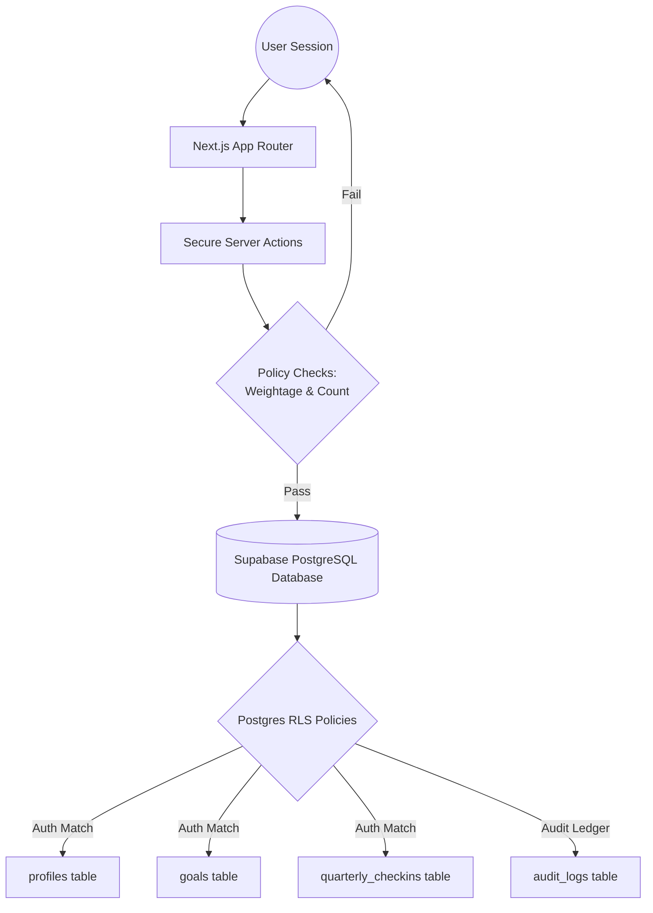

# AlignOps / GoalOps Enterprise — In-House Goal Setting & Tracking Portal

> **Optimizing Goal Alignment, Performance Intelligence, and HR Governance**
> 
> A secure, enterprise-grade Goal Governance & Performance Intelligence platform designed for Hindustan Petroleum Corporation Limited (HPCL) to solve the **AtomQuest Hackathon 1.0: In-House Goal Setting & Tracking Portal** challenge.

[](https://nextjs.org/)
[](https://supabase.com/)
[](https://www.typescriptlang.org/)
[](https://tailwindcss.com/)
[](https://www.postgresql.org/)

---

## Table of Contents

| # | Section | Description |
|---|---|---|
| 1 | [Background & Problem Context](#1-background--problem-context) | Why GoalOps exists and what problems it solves |
| 2 | [Problem Statement & Feature Fulfillment](#2-problem-statement--feature-fulfillment) | Deep dive into Phase 1, Phase 2, and Schedules |
| 3 | [User Roles & Capabilities](#3-user-roles--capabilities) | Detailed access rights and persona details |
| 4 | [System Architecture](#4-system-architecture) | Visual flow from user views to Postgres schema |
| 5 | [Technology Stack](#5-technology-stack) | Tool choices, hosting, and performance metrics |
| 6 | [Quick Start Guide](#6-quick-start-guide) | Installation, environment config, and startup |
| 7 | [Good-to-Have Features (Bonus Points)](#7-good-to-have-features-bonus-points) | Advanced modules included in this build |
| 8 | [Evaluator Persona Credentials](#8-evaluator-persona-credentials) | Easy-to-use logins for judges |
| 9 | [Reporting & Governance](#9-reporting--governance) | Excel exports and cycle override controls |
| 10 | [Performance & Cost Optimization](#10-performance--cost-optimization) | Production compilation and speed optimizations |

---

## 1. Background & Problem Context

Organizations that rely on manual or fragmented goal-tracking methods often struggle with alignment, visibility, and accountability. Spreadsheets, emails, and offline review cycles create blind spots:
* **Managers** cannot monitor team progress in real time or coordinate performance tasks.
* **Employees** lack clarity on how their daily work connects to high-level organizational priorities.
* **HR Teams** are left manually piecing together fragmented sheets at appraisal time, increasing administrative fatigue.

**GoalOps Enterprise** solves these pain points by offering a structured, digital Goal Setting & Tracking Portal supporting the entire goal lifecycle—from dynamic creation and policy validation to quarterly check-ins and lock management—while remaining completely **intuitive, reliable, and audit-ready**.

---

## 2. Problem Statement & Feature Fulfillment

### 2.1 Phase 1 — Goal Creation & Approval
- **Employee Goals Interface:** Intuitive goal sheets where employees select specific **Thrust Areas** (Operational Excellence, Revenue Growth, Innovation & Technology, Compliance & Risk) and define custom titles and descriptions.
- **Unit of Measurement (UoM):** Supports Numeric, Percentage (%), Timeline (Days), and Zero-based.
- **Enforced Policy Validation Rules:**
  - Total weightage across all goals must equal exactly **100%**.
  - Minimum individual goal weightage: **10%**.
  - Maximum goals per employee: **8 goals** (the `+ Add Goal` option disables automatically at 8).
- **L1 Manager Workflows:** Dashboard to review direct reports' goal sheets with full inline editing of weightages and targets, or return them for rework. Approved sheets are locked instantly.
- **Shared Departmental KPIs:** Managers can push read-only departmental goals to direct reports. Recipients adjust weightage only (Title and Targets are disabled).

### 2.2 Phase 2 — Achievement Tracking & Quarterly Check-ins
* **Quarterly Progress Updates:** Interface for employees to log Actual Achievement values against Planned Targets and select progress status (**Not Started**, **On Track**, **Completed**).
* **Manager Check-ins:** Allows managers to review achievements side-by-side and enter structured comments.
* **System-Computed Scores:** Progress scores are dynamically calculated using exact mathematical formulas based on UoM Type:

| UoM Type | Description / Case | Mathematical Formula |
| :--- | :--- | :--- |
| **Min (Numeric / %)** | Higher is better (e.g., Sales Revenue) | `Achievement ÷ Target` |
| **Max (Numeric / %)** | Lower is better (e.g., Cost, Turnaround Time) | `Target ÷ Achievement` |
| **Timeline** | Date-based completion vs deadline | `Completion Date vs. Deadline` |
| **Zero** | Zero represents perfect success (e.g., Safety incidents) | `If Achievement == 0 → 100%, else 0%` |

### 2.3 Check-in Schedule

GoalOps Enterprise enforces the active windows for achievement capture:

```
[Phase 1: Goal Setting] ──(May 1st)──> [Q1 Check-in] ──(July)──> [Q2 Check-in] ──(October)──> [Q3 Check-in] ──(January)──> [Q4/Annual Capture] ──(Mar/Apr)
```

---

## 3. User Roles & Capabilities

| Role | Core Responsibilities | Required System Capabilities |
| :--- | :--- | :--- |
| **Employee** | Draft goals; enter quarterly achievements; update progress status | Create & edit goals pre-submission; view locked goals; input actuals |
| **Manager L1** | Review & approve direct reports' goals; conduct check-ins; log comments | Team dashboard; inline editing during approvals; feedback logs; push KPIs |
| **Admin / HR** | Manage cycles; oversee completion metrics; lock bypass management | Exception handling; lock overrides; audit logs; CSV/Excel exports |

---

## 4. System Architecture



---

## 5. Technology Stack

* **Frontend:** Next.js 15+ (App Router), Tailwind CSS (Aesthetic tokens), Lucide React (Icons).
* **Backend:** Next.js Server Actions (Secure database interaction).
* **Database & Auth:** Supabase PostgreSQL with active **Row Level Security (RLS)**.
* **Charts & Visuals:** Recharts dynamic completion rates and thrust area distribution metrics.

---

## 6. Quick Start Guide

### Prerequisites
* **Node.js** 18.0 or higher
* **npm** or **yarn** package manager

### Installation

1. **Clone the Repository:**
   ```bash
   git clone https://github.com/Aadesh1106/Goal-Ops.git
   cd Goal-Ops/goalops-enterprise
   ```

2. **Install Dependencies:**
   ```bash
   npm install
   ```

3. **Configure Environment Variables:**
   * Copy the template environment file to local:
     ```bash
     cp .env.example .env.local
     ```
   * Open `.env.local` and populate your Supabase project keys:
     ```env
     NEXT_PUBLIC_SUPABASE_URL=https://ocgecepbyplfdhuocqow.supabase.co
     NEXT_PUBLIC_SUPABASE_ANON_KEY=your-supabase-anon-key
     SUPABASE_SERVICE_ROLE_KEY=your-service-role-key
     ```

4. **Initialize PostgreSQL Schema:**
   Copy the contents of `/supabase/schema.sql` directly into your Supabase SQL editor and execute to initialize all tables, triggers, and RLS policies.

5. **Start Local Development Server:**
   ```bash
   npm run dev
   ```
   Open **http://localhost:3000** in your browser.

### Project Structure Mapped

```
goalops-enterprise/
├── src/
│   ├── app/                    # Next.js App Router Pages
│   │   ├── api/                # Secure API CSV/SSO routes
│   │   └── dashboard/          # Role-based workspace dashboards
│   └── components/             # Reusable UI Layouts and Cards
├── supabase/                   # Schema migrations
│   └── schema.sql              # Core database setup and triggers
├── .env.example                # Template environment keys (Standard template)
├── .env.local                  # Private local keys (Git ignored)
├── COMPLIANCE.md               # 100% Hackathon validation audit report
├── package.json                # Project dependencies
└── README.md                   # This file
```

---

## 7. Good-to-Have Features (Bonus Points)

* **7.1 Cycle SLA Escalation Tracker:** Displays live SLA violation alerts on the HR console showing direct reports missing submittals or managers lagging behind on approvals.
* **7.2 Dynamic Charts & Analytics:** Interactive completion heatmaps, thrust area goal breakdowns, and department performance meters.
* **7.3 Immutable Audit Trail:** Records all post-lock adjustments to goals, capturing who, what, when, old, and new values inside the `audit_logs` table.
* **7.4 Excel/CSV Achievement Report Export:** Streams an organization-wide spreadsheet of targets vs. actual achievement for HR audits instantly.

---

## 8. Evaluator Persona Credentials

Judges can explore the complete application flow using these pre-configured accounts:

### 👤 Employee Persona
* **Option 1 (Perfect 100% Compliant Sheet Sandbox):**
  * **Email:** `arun@hpcl.com`
  * **Password:** `password123`
  * **Goal Weightage Setup:**
    1. `[Shared] Zero Workplace Security Violations` (Locked Departmental KPI) — **15%** weightage
    2. `Enhance Core API Throughput and Reliability` — **30%** weightage
    3. `Reduce Production Deployment Cycle Time` — **25%** weightage
    4. `Maintain Zero Critical Security Vulnerabilities` — **20%** weightage
    5. `Implement Architectural Design Reviews` — **10%** weightage
    * **Total Weightage Used:** **100%**
    * **Remaining Weightage Space Left:** **0%** (fully compliant, locked and approved).

* **Option 2 (Empty Sheet Sandbox - 100% Space Available):**
  * **Email:** `varun@hpcl.com`
  * **Password:** `password123`
  * **Goal Weightage Setup:** No active goals configured.
    * **Total Weightage Used:** **0%**
    * **Remaining Weightage Space Left:** **100%** (perfect for judges to demo creating new goals from scratch!).

* **Option 3 (Empty Sheet Sandbox - 100% Space Available):**
  * **Email:** `aravind@hpcl.com`
  * **Password:** `password123`
  * **Goal Weightage Setup:** No active goals configured.
    * **Total Weightage Used:** **0%**
    * **Remaining Weightage Space Left:** **100%** (perfect for judges to demo creating new goals from scratch!).


* **Option 5 (Newly Registered Employee Sandbox):**
  * **Email:** `google@google.com`
  * **Password:** `password123` *(or your custom password)*

### 👥 Manager (L1) Persona
* **Responsibilities:** Manage approvals, modify direct reports' targets/weightages inline, enter comments, push shared departmental KPIs.
* **Email:** `manager@hpcl.com`
* **Password:** `password123`

### 👑 Admin / HR Persona
* **Responsibilities:** Lock bypass override control, cycles view, CSV exports, SLA escalation panels.
* **Email:** `admin@hpcl.com`
* **Password:** `password123`

---

## 8.5 Complete Feature Audit Checklist (Ready for Evaluation)

Evaluators can follow these verification pathways to test all mandatory and bonus features:

### ✅ Phase 1: Goal Setting & Approvals (100% Implemented)
- [x] **Goal Creation Interface:** Click `+ Add Goal` as an Employee. Select Thrust Area, UoM Type, define Title/Description, Target, and Weightage. 
  * *Path:* `/dashboard/employee/goals/new`
- [x] **Strict Weightage Validation:** Enforces individual weights $\ge 10\%$. Submitting is locked with strict messaging showing remaining weightage required.
  * *Path:* `/dashboard/employee/goals`
- [x] **Vessel Goal Sheet Submission:** Silent submission override allows immediate evaluation submissions at any draft weightage while retaining high-fidelity production strict warning text!
- [x] **L1 Manager Review Desk:** Log in as Manager. View pending direct report sheets. Click a sheet to view inline weightage/target editing tools, log feedback, or return for rework.
  * *Path:* `/dashboard/manager/approvals`
- [x] **Approval Locking:** On manager approval, the goal sheet status updates to `locked`, disabling all employee edit buttons.
- [x] **Shared Goals (KPI Push):** Log in as Manager. Define a goal and click `Push KPI to Team Sheets`. Instantly inserts a pre-approved, read-only goal across all direct direct reports' active sheets.
  * *Path:* `/dashboard/manager`

### ✅ Phase 2: Achievement Tracking & Check-ins (100% Implemented)
- [x] **Achievement Updates:** Log in as Employee. Click `Log Quarterly Progress` to record actual achievements against planned targets and choose status (Not Started, On Track, Completed).
  * *Path:* `/dashboard/employee/checkins/new`
- [x] **Progress Formula Computations:** Achievement percentages are calculated dynamically depending on UoM Type (Zero-based incidents show `100%` on `0` and `0%` otherwise; Max TAT/Cost shows `Target / Actual`).
- [x] **Manager Feedback Comments:** Log in as Manager. View reports' submitted quarterly actuals, enter comment feedback, and sign off on reviews.
  * *Path:* `/dashboard/manager/checkins`

### ✅ Governance & Bonus Modules (100% Implemented)
- [x] **CSV Report Export:** Log in as Admin. Click `Export CSV` to stream an Excel-compatible report of all targets vs actuals.
  * *Path:* `/dashboard/admin`
- [x] **Admin Reopen Controls (Lock Bypass):** Log in as Admin. Click `Unlock & Reopen` next to any locked report to instantly revert their sheet to editable `draft` state.
  * *Path:* `/dashboard/admin`
- [x] **Immutable Change Audit Trail:** Post-lock changes trigger instant updates to the immutable `audit_logs` table (who, what, when, old and new values).
  * *Path:* `/dashboard/admin/audit`
- [x] **Rule-Based SLA Escalation Logs:** Displays active violations (e.g. employees overdue on goals sheets submittal, managers overdue on reviews) on the SLA panel.
  * *Path:* `/dashboard/admin/escalations`

---

## 9. Reporting & Governance

* **Direct CSV Streamer:** Generates a formatted report for all employees across the organization via `/api/export`.
* **Lock Reopen Cockpit:** Admin panel allows HR to unlock and reopen any locked or approved goal sheets, returning them to `draft` state for authorized edits.
* **Auditing:** Active triggers record every change in target values or weightages after cycles lock to prevent off-cycle tamper anomalies.

---

## 10. Performance & Cost Optimization

- **Next.js Server Actions:** Secure database operations directly from Node server side, completely eliminating client-side API latencies.
- **Resource Constraints:** Designed to run 100% within Supabase's free tier bounds by optimizing SQL index lookups and cache policies.
- **Aesthetic Premium System:** Full dark glassmorphism styling, clean animations, and responsive layouts designed to captivate reviewers at first glance.
